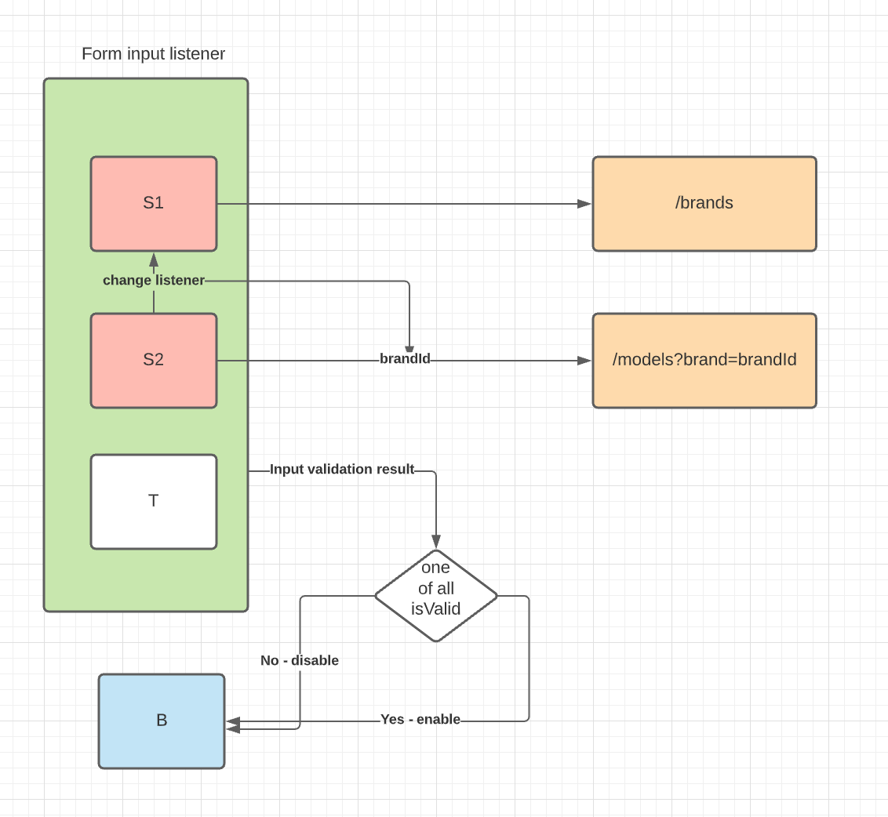

# Solution

Interesting task!

First of all we need to consider the fact that form items are gonna have potential updates plus we need to have reusability of the components in place. As I see the task is super simple and tricky at the same time due to the:

- default select options
- empty API call select options
- potential languages support for select options
- asyncronuous data handling (might be post load updates of selected values with triggering change event)
- button enabling/disabling on the fly

There are different approaches to the problem:

- listening to a form state object
- use observer pattern
- use pub/sub
- use native validation events
- ...you name it

There is no need to make it overcomplicated
- no need to have a state as we just send a form data at some point.
- no need to observe a value and use many observers here as the potential feature will listent to the value of another select
- no use of custom events as we can use default ones to subscribe to
- native validation events are also not necessarily in this case

The current solution:
1. listen to the items updates to check whether one of those is valid and we can enable button
1. connect every select to remote API and get data depending on a parameter if required

The solution consist of 2 modules: `form` module to fulfill first criteria, `connected select` module to load and handle a select input.

These components are customisable via props that have declarative hature and can be reused easily in any other place. The common validation is still be not reusable (1 of 3 items required to be valid).

Acording to this description:

* RemoteSelect component - handles API calls for a particular data item
* CarSearchForm component - handles top level events like form validation and submit button
* Declarative approach - allows us to use different endpoints, languages support, custom messages for different states

## Start the project

`npx serve public` - start a local server

`npx serve public -l 3000` - start a local server on port 3000

## Resume

It took me approximatelly 3 sessions by 2-3 hrs to implement this. Half of the time I spent recalling the custom validation implementation as I was planning to use it. Currently there is no need for that and I removed all the functionallity related to it. One of the potential bottlenecks was handling custom validation messages along with the whole form input, as form input is triggered before! the custom message was set.